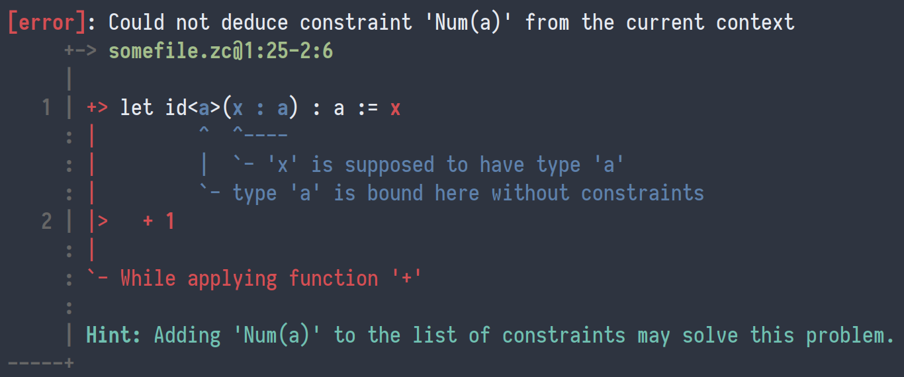

# Error reporting made easy

Diagnose is a small library used to report compiler/interpreter errors in a beautiful yet readable way.
It was in the beginning heavily inspired by [ariadne](https://github.com/zesterer/ariadne), but ended up quickly becoming its own thing.

As a great example, here's the output of the last test:


If you do not like unicode characters, or choose to target platforms which cannot output them natively;
you may alternatively print the whole diagnostic with ASCII characters, like this:



Colors are also optional, and you may choose not to print them.

## Features

- Show diagnostics with/without 8-bit colors, with/without Unicode characters
- Inline and multiline markers are nicely displayed
- The order of markers matters!
  If there are multiple markers on the same line, they are ordered according to how they were put in each report
- Reports spanning across multiple files are handled as well
- Generic over the type of message which can be displayed, meaning that you can output custom data types as well as they can be pretty-printed
- Diagnostics can be exported to JSON, if you don't quite like the rendering as it is, or if you need to transmit them to e.g. a website
- Plug and play (mega)parsec integration and it magically works with your parsers!
- Support for optional custom error codes, if you want to go the Rust way
- Variable width Unicode characters are handled in a crossplatform manner
- TAB characters have custom sizes specified when printing a diagnostic, so that *you* decide the width of a TAB, not your terminal emulator!
- Colors can be tweaked thanks to the ability to export diagnostics as `Doc`uments

## Usage

You only need to `import Error.Diagnose`, and everything should be ready to go.
You don't even need to `import Prettyprinter`, as it is already provided to you by `Error.Diagnose`!

--------

A diagnostic can be viewed as a collection of reports, spanning on files.
This is what the `Diagnostic` type embodies.

It has a `Default` instance, which can be used to construct an empty diagnostic (contains no reports, and has no files).

The second step is to add some reports.
There are two kinds of reports:
- Error reports, created through `err`
- Warning reports, created by using `warn`

Both of these fonctions have the following type:
```haskell
-- | An optional error code, shown right after @error@ or @warning@ in the square brackets
Maybe msg ->
-- | The main message, which is output at the top right after @[error]@ or @[warning]@
msg ->
-- | A list of markers, along with the positions they span on
[(Position, Marker msg)] ->
-- | Some hints to be output at the bottom of the report
[msg] ->
-- | The created report
Report msg
```

Each report contains markers, which are what underlines the code in the screenshots above.
They come in three flavors:
- A `This` marker indicates the main reason of the error.
  It is highlighted in red (for errors) or yellow (for warnings).
  Ideally, there is only one per report, but this isn't strictly required.
- A `Where` marker adds additional context to the error by adding highlighted code to the error.
  This can be used to remind used that a variable was found of a given type earlier, or even where a previous declaration was found in another file.
  This is output in blue by default.
- A `Maybe` marker is probably the rarest one.
  It is basically a way of suggesting fixes (as when GCC tells you that you probably mistyped a variable name).
  These markers are highlighted in green.

The `Position` datatype is however required to be used with this library.
If you use another way of keeping track of position information, you will need to convert them to the `Position` datatype.

Once your reports are created, you will need to add them inside the diagnostic using `addReport`.
You will also need to put your files into the diagnostic with `addFile`, else lines won't be printed and you will get `<no-line>` in your reports.

After all of this is done, you may choose to either:
- print the diagnostic onto a file `Handle` (most likely `stdout` or `stderr`) using `printDiagnostic`;
- create a `Doc`ument which can be further altered using `prettyDiagnostic`;
- or export it to JSON with `diagnosticToJson` or the `ToJSON` class of Aeson (the output format is documented under the `diagnosticToJson` function).

## Example

Here is how the above screenshot was generated:
```haskell
let beautifulExample =
      err
        Nothing
        "Could not deduce constraint 'Num(a)' from the current context"
        [ (Position (1, 25) (2, 6) "somefile.zc", This "While applying function '+'"),
          (Position (1, 11) (1, 16) "somefile.zc", Where "'x' is supposed to have type 'a'"),
          (Position (1, 8) (1, 9) "somefile.zc", Where "type 'a' is bound here without constraints")
        ]
        ["Adding 'Num(a)' to the list of constraints may solve this problem."]

-- Create the diagnostic 
let diagnostic  = addFile def "somefile.zc" "let id<a>(x : a) : a := x\n  + 1"
let diagnostic' = addReport diagnostic beautifulExample

-- Print with unicode characters, colors and the default style
printDiagnostic stdout True True 4 defaultStyle diagnostic'
```

More examples are given in the [`test/rendering`](./test/rendering) folder (execute `stack test` to see the output).

## TODO list

<< empty, for now >>

## License

This work is licensed under the BSD-3 clause license.

Copyright (c) 2021-2022 Mesabloo, all rights reserved.
